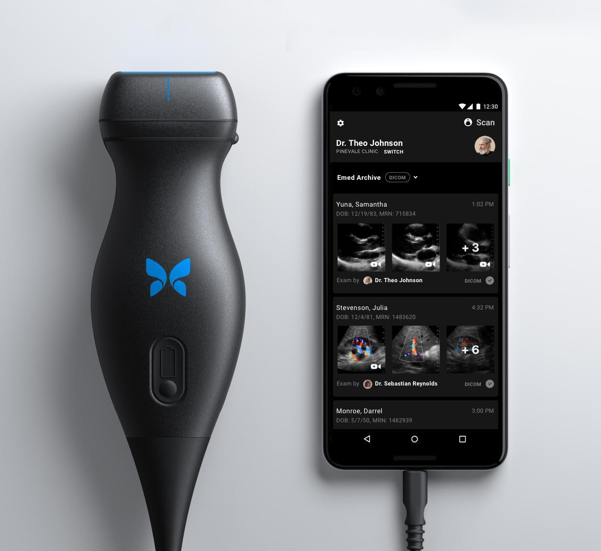
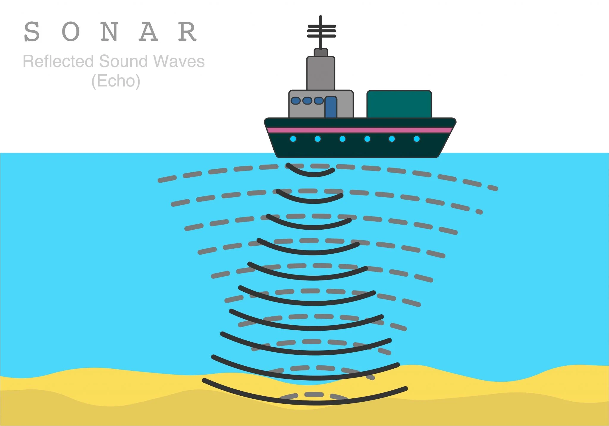
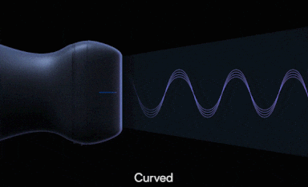
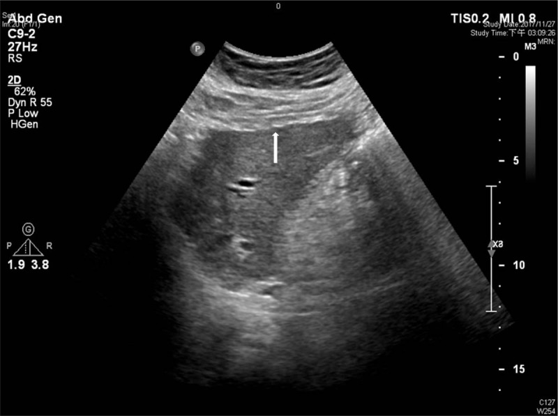

# Introduction to Point-of-Care Ultrasound

## What is Point-of-Care Ultrasound?

“Point-of-Care Ultrasound” or POCUS, is a versatile, non-invasive
imaging technique that uses sound waves emitted from a probe to quickly
evaluate part of a patient’s body. Due to the speed of evaluation, lack
of radiation, low cost, and portability, POCUS has become a first-line
tool to diagnosis a range of medical conditions.

Butterfly probes are a common tool for POCUS studies.

## How does POCUS work?

The principle of POCUS works is very similar to how sonar works on
ships.

Ships use sonar waves to determine objects’ locations.

To start, high frequency sound waves are emitted by the
probe/transducer. These waves travel through the patient at different
speeds, depending on the density of the patient’s tissues. As the sound
waves bounce back, the transducer converts the time the waves return
into a distance and density, forming an image.

POCUS transducers use sound to determine tissues’ locations.

## What does POCUS look like?

POCUS imaging of a heart.

POCUS imaging of an eye.

POCUS imaging of a knee.

# POCUS-Addressable Conditions in Gastroenterology

Given the excellent soft tissue resolution of POCUS, it is frequently
used to evaluate conditions in gastroenterology (GI). Illnesses often
diagnosed via POCUS include cholecystitis, inflammatory bowel disease,
and liver cirrhosis.

## Cholecystitis

Cholecystitis refers to inflammation of the gallbladder wall, usually
due to a gallstone blocking the cystic duct and preventing bile
drainage. When the gallbladder gets inflamed, patients often experience
severe right upper quadrant (RUQ) abdominal pain, nausea, vomiting, and
fever. They may also present with yellow skin or eye sclera, due to
jaundice.

## Inflammatory Bowel Disease

Inflammatory bowel disease, or IBD, is a set of autoimmune conditions
affecting the GI tract. One type of IBD, ulcerative colitis, is
associated with bloody diarrhea and urgency to defecate. Another form of
IBD, Crohn disease, is associated with right lower quadrant (RLQ)
abdominal pain and non-bloody diarrhea.

## Liver Cirrhosis

Liver cirrhosis, or scarring of the liver parenchymal tissue, is one of
top 15 leading causes of death in the US. In the US, cirrhosis is
predominantly caused by chronic alcohol consumption or infection with
hepatitis C virus (HCV). Despite the high mortality associated with
cirrhosis, patients are often asymptomatic, or present with nonspecific
symptoms like fatigue, weight loss, anorexia, and weakness (Nassereldine
2024).

# How to Perform Common GI POCUS Procedures

As with any imaging technique, the location of the anatomy of interest
informs probe placement. To begin, have the patient lie supine and
uncover their abdomen. Set the ultrasound settings to the appropriate
preset. Apply gel to the probe. Evaluation for each condition proceeds
as follows:

## Cholecystitis

Place the probe at the intersection of the right mid-clavicular line and
costal margin. Angle the transducer such that the probe marker points
toward the left shoulder. The gallbladder should appear as an anechoic
(dark) oval structure.

Image: POCUS Gallbladder

A diagnosis of cholecystitis is suggested when the following conditions
are found:

-   Gallstones (hyperechoic/white stones that cast a “shadow”) or sludge

And at least one of the following:

-   Thickening of the gallbladder wall ($&gt;$4 mm)

-   Fluid around the gallbladder (pericholecystic fluid)

-   Patient reports sharp pain when the probe is pressed upon expiration
    (sonographic Murphy’s sign)

## Inflammatory Bowel Disease

To evaluate the colon, place the probe medially to the anterior superior
iliac crest (ASIC) such that the probe marker points towards the
patient’s right. Follow the path of the large intestine superiorly, then
transversely, then inferiorly. Changes suggestive of IBD include bowel
wall thickness &gt; 2mm in the colon, difficulty visualizing the 5
layers of the GI wall, and any asymmetry along the course of the tract
(Atkinson, 2017).

## Liver Cirrhosis

Place the probe at the intersection of the right mid-clavicular line and
costal margin, angling the probe marker to point towards the right
elbow. Fan the probe through the liver, evaluating for a diminished
liver size, nodular surface, and coarse parenchyma. The presence of any
of these findings is suggestive of liver cirrhosis (Yen, 2019).

Nodules present on a liver surface.

# The Future of POCUS in GI

POCUS serves as an effective tool to evaluate patients for a variety of
GI conditions, and its utility continues to expand. For example, the
exponential growth in GLP-1 agonist use has led to concerns about
retained gastric contents causing aspiration in patients undergoing
upper endoscopies on these medications. POCUS presents an emerging
method to quickly assess gastric volume and contents before patients
undergo procedures (Kalagara, 2023). As other challenges in medicine
arrive, POCUS may be uniquely equipped to improve patient’s healthcare
experiences.

# References

Atkinson, N. S., Bryant, R. V., Dong, Y., Maaser, C., Kucharzik, T.,
Maconi, G., … & Dietrich, C. F. (2017). How to perform gastrointestinal
ultrasound: Anatomy and normal findings. World journal of
gastroenterology, 23(38), 6931.

Kalagara, H., Sondekoppam, R. V., Ahmed, A. M., Venkata, K., Pierce, A.,
Roth, K. J., … & Peter, S. (2023). Feasibility and Utility of Routine
Point‐of‐Care Gastric Ultrasonography in Patients Undergoing Upper
Gastrointestinal Endoscopy Procedures: A Prospective Cohort Study.
Journal of Ultrasound in Medicine, 42(11), 2643-2652.

Nassereldine, Hasan et al. The burden of cirrhosis mortality by county,
race, and ethnicity in the USA, 2000–19: a systematic analysis of health
disparities. The Lancet Public Health, Volume 9, Issue 8, e551 - e563

Yen, Y. H., Kuo, F. Y., Chen, C. H., Hu, T. H., Lu, S. N., Wang, J. H.,
& Hung, C. H. (2019). Ultrasound is highly specific in diagnosing
compensated cirrhosis in chronic hepatitis C patients in real world
clinical practice. Medicine, 98(27), e16270.

#### Disclaimer: The contents of this page are for informational purposes only and are intended to demonstrate applications of POCUS. The contents are not a substitute for professional clinician training and experience. Clinicians are solely responsible for patient care and for exercising their independent clinical judgement at all times.
